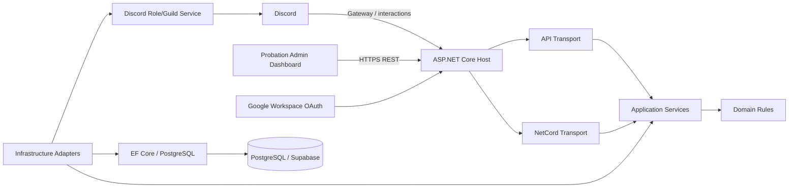
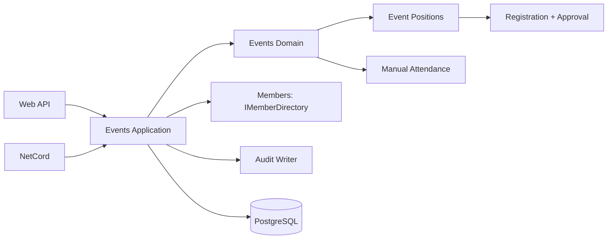

# Architecture

## Style
Single deployable ASP.NET Core .NET 10 application (modular monolith). Web API and NetCord bot share the same DI container and application services. PostgreSQL is the system of record.



## Approved solution structure
```text
Felion.slnx
src/
  Felion.Host/                 # composition root, ASP.NET Core, auth, OpenAPI, health
  Felion.Domain/               # entities/value objects/invariants; no NetCord/EF
  Felion.Application/          # use cases, DTOs, authorization abstractions
  Felion.Infrastructure/       # EF Core, PostgreSQL, Google/Discord adapters, imports
  Felion.Bot/                  # NetCord commands/components/modal handlers
  Felion.Api/                  # endpoint modules/controllers/minimal API routes
tests/
  Felion.Domain.Tests/
  Felion.Application.Tests/
  Felion.IntegrationTests/
```
This structure is approved and user-owned. The user creates this skeleton manually before the agent starts. `Felion.Host` is the only executable/composition root; `Felion.Api` and `Felion.Bot` are class-library adapters and must remain separate unless the user explicitly approves a change.

### Project dependency direction
```text
Felion.Host
├── Felion.Api
├── Felion.Bot
└── Felion.Infrastructure

Felion.Api ────────────> Felion.Application
Felion.Bot ────────────> Felion.Application
Felion.Infrastructure ─> Felion.Application
Felion.Application ────> Felion.Domain
```

`Felion.Domain` has no framework/infrastructure dependency. The agent must not reorganize these project boundaries silently.

## Modules
- Identity & Authorization
- Members
- Discord Integration
- Probation
- Evaluations
- Audit
- Imports
- Events & Attendance
- Configuration

## Shared use cases
Both HTTP and Discord transports call the same use cases, for example:
- `LinkDiscordIdentity`
- `UnlinkDiscordIdentity`
- `SynchronizeDiscordRoles`
- `ImportMembers`
- `CreateProbationTeam`
- `AssignMentor`
- `CreateEvaluationPeriod`
- `CloseEvaluationPeriod`
- `SubmitPeerEvaluation`
- `SubmitMentorEvaluation`
- `ViewEvaluation`
- `SummarizeEvaluationPeriod`
- `DecideProbationCandidates`
- `CreateEvent` / `PublishEvent`
- `EvaluateEventEligibility`
- `RegisterForEvent` / `CancelEventRegistration`
- `CheckInEvent` / `CorrectAttendance`

## Authentication and authorization
Web: cookie or API-compatible session authentication backed by Google OAuth/OpenID Connect. On ticket validation/sign-in callback, resolve normalized email against an active Member. Create application claims from DB position/member id; do not trust an email domain as authorization.

Discord: derive Discord user id from interaction context, resolve linked Member, then apply the same application authorization policies. Probation-only commands resolve ProbationCandidate instead.

Suggested policies: `ActiveMember`, `CoreOrAdmin`, `AdminOnly`, `MentorOfTeam`.

## Transactions and external side effects
Database transactions cannot atomically include Discord API calls. Use idempotent application operations and explicit state/audit. Role synchronization is executed immediately after the relevant database mutation from current data; `/role sync` can reconcile every active linked identity. The phase-1 `DiscordSyncJob` table and hosted worker are retained only for the non-role `KickUser` side effect after FAIL, with durable retry backoff and bounded idle polling.

## NetCord transport
Prefer NetCord application commands + component interactions (buttons/modals). The verification button opens the StudentId modal. Command/component handlers contain no EF queries directly; call application services.

## API
Use `/api/v1`. Return Problem Details for errors. Generate OpenAPI. Use pagination for collections. Bulk endpoints return per-item outcomes and a correlation id.

The initial internal Probation Admin Dashboard is framework-free static HTML/CSS/ES modules hosted by `Felion.Host` under `/admin/probation/`. It uses the existing same-origin Google cookie session and calls the API; it contains no authorization, validation, promotion/failure or domain workflow logic.

Suggested endpoint groups:
- `/auth/*`
- `/members/*`
- `/probation/candidates/*`
- `/probation/teams/*`
- `/probation/evaluation-periods/*`
- `/probation/evaluations/*`
- `/discord/roles/*`
- `/discord/role-assignments/*`
- `/discord/sync/*`
- `/imports/members`
- `/audit`
- `/events/*`
- `/events/{eventId}/registrations/*`
- `/events/{eventId}/check-ins/*`

## Observability
Structured logging, request correlation id, health checks for DB and Discord connectivity, and no secret/token logging.


## Module boundaries for future growth
Treat Felion as a modular monolith with vertical domain modules, not a CRUD application organized around database tables. `Members`, `Probation`, `Events`, `Discord`, `Identity`, and `Audit` own their rules and expose application contracts/use cases. Transports (HTTP/NetCord) orchestrate those contracts and never reach across modules through another module's DbSet/repository.

Recommended dependency rule:
```text
Transport (API / Bot)
        |
        v
Application module contracts/use cases
        |
        v
Domain module
        |
        v
Infrastructure adapters
```

Cross-module references use stable IDs and application queries/contracts. For example Events stores `MemberId`, but does not own or mutate Member. Probation promotion calls a Members application contract rather than constructing EF Member rows from a bot handler. This keeps a later extraction to separate services possible without requiring it now.

Do not introduce a generic `Repository<T>` or generic event/rule engine. Prefer module-specific ports such as `IMemberDirectory`, `IEventEligibilityEvaluator`, `IDiscordGuildService`, and `IAuditWriter`.

## Events & Attendance boundary


The aggregate boundary is `Event`, with event-local `EventPosition` children/policies. Registration targets a position, never the Event directly. A position currently has only one optional eligibility predicate: `RequiredDepartmentId`. Keep this typed and explicit; do not build a generic rule engine until requirements demand it.

Registration and attendance are separate facts. Member request -> Pending -> Core/Admin Approved/Rejected. Core/Admin can directly assign a Member and bypass Department eligibility. Capacity and `AllowMultiplePositions` remain invariants and must be concurrency-safe.

Attendance is event-level and manual. Core/Admin can check in an active Member without registration/assignment while the Event is `InProgress` or `Completed`. This intentionally supports people who appeared and helped without registering, including omitted history added after completion. The attendance record is the source for later Member activity statistics.

Every Core manages every Event. Do not introduce EventManager ownership/ACL tables. `CreatedByMemberId` is audit provenance only. All privileged changes flow through application use cases and AuditLog.
