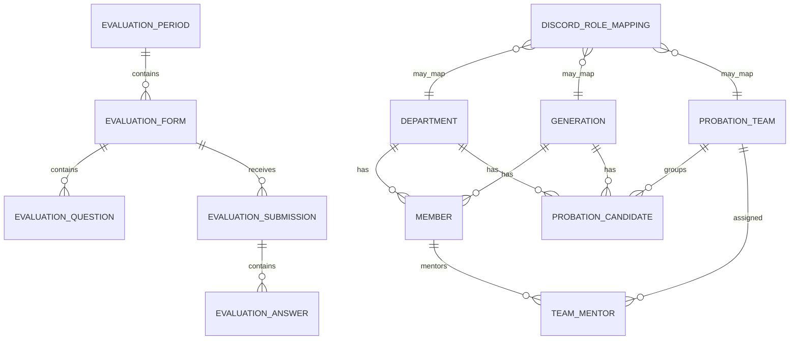
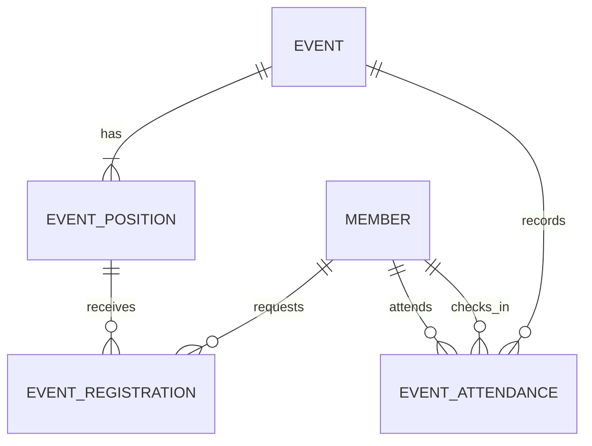

# Data Model (logical)

Use UUID/Guid primary keys for application entities unless a strong reason exists otherwise. Add created/updated UTC timestamps where useful.

## Core tables
### Member
`Id, StudentId, FullName, ClubEmail, DepartmentId, GenerationId, Position(Admin|Core|Member), Status(Active|Inactive), DiscordUserId?, LinkedAt?`

Constraints/indexes:
- unique normalized StudentId
- unique normalized ClubEmail
- unique DiscordUserId when non-null
- one Department, one Generation

### ProbationCandidate
`Id, StudentId, FullName, DepartmentId, GenerationId, TeamId?, Status(Active|Passed|Failed|Archived), DiscordUserId?, LinkedAt?`

Constraints/indexes:
- unique active/retained StudentId according to retention strategy
- unique DiscordUserId when non-null

Cross-table Discord/StudentId uniqueness cannot be expressed by two independent unique indexes. Prefer a dedicated `DiscordIdentityLink` table if clean global uniqueness is needed:
`Id, DiscordUserId UNIQUE, StudentId UNIQUE, SubjectType(Member|Probation), SubjectId UNIQUE, LinkedAt`.
This is the recommended design; Member/ProbationCandidate need not duplicate DiscordUserId.

### Department
`Id, Name, Slug, IsActive`

### Generation
`Id, Name, Code, IsActive`

### ProbationTeam
`Id, Name, IsActive`

### TeamMentor
`TeamId, MemberId` composite unique key. Validate Member.Status=Active.

### DiscordRoleMapping
`Id, Kind(Position|Probation|Department|Generation|ProbationTeam), Key/SubjectId, DiscordRoleId, RoleNameSnapshot, UpdatedAt`
Unique mapping for each logical subject. Guild ID lives in app configuration because only one guild is supported.

## Evaluation
### EvaluationPeriod
`Id, Name, StartsAt?, EndsAt?, Status(Draft|Open|Closed)`

### EvaluationForm
`Id, PeriodId, Name, ReviewerType(Peer|Mentor), IsActive`
Allow separate peer and mentor forms.

### EvaluationQuestion
`Id, FormId, Order, Prompt, Type(Score|Text), IsRequired, ScoreMin?, ScoreMax?, TextMaxLength?`
Check constraints ensure Score settings only apply to Score and text settings only to Text.

### EvaluationSubmission
`Id, FormId, PeriodId, ReviewerType, ReviewerMemberId?, ReviewerCandidateId?, TargetCandidateId?, TargetStudentIdSnapshot, TargetNameSnapshot, SubmittedAt, UpdatedAt`
Use nullable reviewer FKs according to reviewer type and snapshots so retained evaluation remains understandable after candidate deletion. Add a unique constraint equivalent to `(FormId, Reviewer identity, TargetCandidateId)` while target exists; application validation handles archived/deleted edge cases.

### EvaluationAnswer
`Id, SubmissionId, QuestionId?, QuestionPromptSnapshot, QuestionTypeSnapshot, ScoreValue?, TextValue?`
Snapshot question prompt/type to preserve history if forms are edited/deleted.

## AuditLog
`Id, OccurredAt, ActorType(WebMember|DiscordMember|System), ActorMemberId?, ActorDiscordUserId?, Action, EntityType, EntityId?, CorrelationId, MetadataJson, BeforeJson?, AfterJson?`
No cascade delete from domain entities into AuditLog.

## DiscordSyncJob (recommended)
`Id, SubjectType, SubjectId, Operation, PayloadJson, Status(Pending|Running|Succeeded|Failed), Attempts, LastError?, CreatedAt, UpdatedAt`
Used to retry role changes/kicks after DB decisions.

# Planned Events & Attendance model
Keep these tables in the Events module/schema ownership when implemented.

### Event
`Id, Name, Description?, Location?, StartsAt, EndsAt?, Status(Draft|Published|RegistrationClosed|InProgress|Completed|Cancelled), AllowMultiplePositions=false, CreatedByMemberId, CreatedAt, UpdatedAt`

Events are voluntary. Do not add required participation, target audience, absence, excuse, checkout, or attendance booleans to Event/Member.

### EventPosition
`Id, EventId, Name, Description?, Capacity, RequiredDepartmentId?, SortOrder, CreatedAt, UpdatedAt`

`RequiredDepartmentId = null` means any active Member may request the position. Capacity is a hard limit; there is no waitlist. Position is event-local and must not reuse Department as the position entity.

### EventRegistration
`Id, EventPositionId, MemberId, Status(Pending|Approved|Rejected|Cancelled|Assigned), RequestedAt?, DecidedAt?, DecidedByMemberId?, AssignedAt?, AssignedByMemberId?, CancelledAt?`

Normal Member registration always starts `Pending` after lifecycle, eligibility, duplicate/multiple-position and capacity checks. `Approved` means Core/Admin accepted a request. `Assigned` means Core/Admin directly placed the Member and may bypass Department eligibility. Core/Admin may not bypass `AllowMultiplePositions`; do not assume capacity bypass.

Use database/application constraints to prevent duplicate active registration for the same `(EventPositionId, MemberId)`. When `AllowMultiplePositions=false`, enforce at the application/domain level (and with a safe database strategy where practical) that a Member cannot hold multiple accepted/assigned positions in the same Event. Capacity approval must be concurrency-safe; two Core actions must not overfill a position.

### EventAttendance
`Id, EventId, MemberId, CheckedInAt, CheckedInByMemberId, CreatedAt`

Attendance is independent of EventRegistration. Core/Admin may create attendance for an active Member without registration or assignment. Enforce unique `(EventId, MemberId)`. Do not infer attendance from registration and do not add checkout in current scope.

### Historical integrity
Events may reference stable Member IDs but must not mutate Member. Avoid cascade delete from Member into registration/attendance. Attendance is club history used for Member activity reporting and should survive deactivation. All privileged event mutations are also written to AuditLog.

## Member/Department invariant
`Member.DepartmentId` is required. The domain/application layer must enforce: `Position in (Admin, Core) => Department == Core`; `Position == Member => Department != Core`. Treat `Core` as a protected/reference Department rather than a nullable workaround. Previous Department is not retained after promotion.
