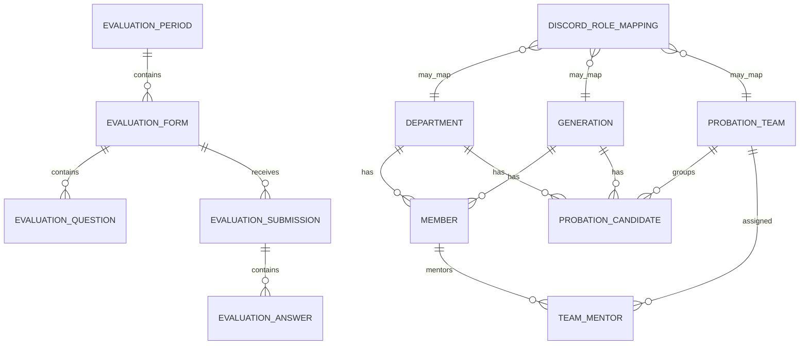
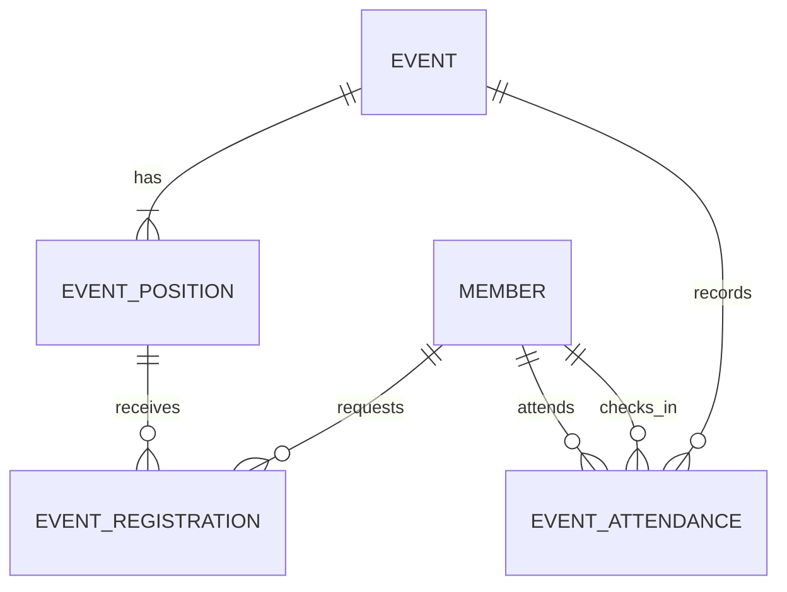

# Data Model (logical)

Use UUID/Guid primary keys for application entities unless a strong reason exists otherwise. Add created/updated UTC timestamps where useful.

## Core tables
### Member
`Id, StudentId, FullName, ClubEmail, DepartmentId, GenerationId, Position(Admin|Core|Member), Status(Active|Inactive), DiscordUserId?, LinkedAt?`

Constraints/indexes:
- unique normalized StudentId
- unique normalized ClubEmail
- unique DiscordUserId when non-null
- one Department, one Generation

### ProbationCandidate
`Id, StudentId, FullName, DepartmentId, GenerationId, TeamId?, Status(Active|Passed|Failed|Archived), DiscordUserId?, LinkedAt?`

Constraints/indexes:
- unique active/retained StudentId according to retention strategy
- unique DiscordUserId when non-null

Cross-table Discord/StudentId uniqueness cannot be expressed by two independent unique indexes. Prefer a dedicated `DiscordIdentityLink` table if clean global uniqueness is needed:
`Id, DiscordUserId UNIQUE, StudentId UNIQUE, SubjectType(Member|Probation), SubjectId UNIQUE, LinkedAt`.
This is the recommended design; Member/ProbationCandidate need not duplicate DiscordUserId.

### Department
`Id, Name, Slug, IsActive`

### Generation
`Id, Name, Code, IsActive`

### ProbationTeam
`Id, Name, IsActive, CreatedAt, UpdatedAt`

### TeamMentor
`TeamId, MemberId` composite unique key. Validate Member.Status=Active.

Team and mentor foreign keys use restrict semantics so historical audit and evaluation data are not removed by team/member changes.

### DiscordRoleMapping
`Id, Kind(Position|Probation|Department|Generation|ProbationTeam), Key/SubjectId, DiscordRoleId, RoleNameSnapshot, UpdatedAt`
Unique mapping for each logical subject. Guild ID lives in app configuration because only one guild is supported.

### DiscordRoleAssignment
`Id, SubjectType(Member|Probation), SubjectId, DiscordRoleId, RoleNameSnapshot, CreatedAt, UpdatedAt`
Stores Admin-managed role assignments for one active Member or ProbationCandidate. The unique key is `(SubjectType, SubjectId, DiscordRoleId)`; the polymorphic subject has no cascade foreign key. PASS explicitly transfers assignments to the new Member, while FAIL explicitly removes them. Role synchronization manages the union of automatic mappings and these per-subject assignments.

## Evaluation
### EvaluationPeriod
`Id, Name, CreatedAt, OpenedAt, ClosedAt?, UpdatedAt, Status(Open|Closed)`

Admin creates a period in Open status and Admin closes it. There is no Draft state or scheduler.

### PeerEvaluation
`Id, EvaluationPeriodId, EvaluatorCandidateId, TargetCandidateId, Contribution, Communication, Attitude, Note?, CreatedAt, UpdatedAt?, EvaluatorStudentIdSnapshot, EvaluatorNameSnapshot, TargetStudentIdSnapshot, TargetNameSnapshot`

Scores are integer 1..5. The unique key is `(EvaluationPeriodId, EvaluatorCandidateId, TargetCandidateId)`. Candidate IDs are retained as historical references without cascade deletion; snapshots preserve meaning after candidate archival/deletion.

### MentorEvaluation
`Id, EvaluationPeriodId, MentorMemberId, TargetCandidateId, Attendance, TaskCompletion, LearningInitiative, Note?, CreatedAt, UpdatedAt?, MentorStudentIdSnapshot, MentorNameSnapshot, TargetStudentIdSnapshot, TargetNameSnapshot`

Scores are integer 1..10. The unique key is `(EvaluationPeriodId, MentorMemberId, TargetCandidateId)`. Multiple mentors may evaluate the same candidate. There is no generic form/question/criteria table and no shared FinalScore.

## AuditLog
`Id, OccurredAt, ActorType(WebMember|DiscordMember|System), ActorMemberId?, ActorDiscordUserId?, Action, EntityType, EntityId?, CorrelationId, MetadataJson, BeforeJson?, AfterJson?`
No cascade delete from domain entities into AuditLog.

## DiscordSyncJob (recommended)
`Id, SubjectType, SubjectId, Operation(KickUser), PayloadJson, Status(Pending|Running|Succeeded|Failed), Attempts, LastError?, NextAttemptAt, CreatedAt, UpdatedAt`
Used to retry role changes/kicks after DB decisions. The worker claims only pending/failed jobs whose `NextAttemptAt` has arrived. Failed jobs use exponential backoff capped at one hour, and the worker's idle database poll runs every 30 seconds.

## Probation decision configuration
`Probation:SuccessPolicy = Archive | Delete` (default `Archive`) controls PASS retention. `Probation:FailurePolicy = MarkInactive | Delete` controls FAIL retention. PASS creates a regular Member and derives `ClubEmail` from the candidate name and configured Workspace domain.

# Events & Attendance model
These tables are owned by the Events module/schema and are implemented by the Events module.

### Event
`Id, Name, Description?, Location?, StartsAt, EndsAt?, Status(Draft|Published|RegistrationClosed|InProgress|Completed|Cancelled), AllowMultiplePositions=false, CreatedByMemberId, CreatedAt, UpdatedAt`

Events are voluntary. Do not add required participation, target audience, absence, excuse, checkout, or attendance booleans to Event/Member.

### EventPosition
`Id, EventId, Name, Description?, Capacity, RequiredDepartmentId?, SortOrder, CreatedAt, UpdatedAt`

`RequiredDepartmentId = null` means any active Member may request the position. Capacity is a hard limit; there is no waitlist. Position is event-local and must not reuse Department as the position entity.

### EventRegistration
`Id, EventPositionId, MemberId, Status(Pending|Approved|Rejected|Cancelled|Assigned), RequestedAt?, DecidedAt?, DecidedByMemberId?, AssignedAt?, AssignedByMemberId?, CancelledAt?`

Normal Member registration always starts `Pending` after lifecycle, eligibility, duplicate/multiple-position and capacity checks. `Pending`, `Approved` and `Assigned` consume one capacity slot. `Rejected` and `Cancelled` do not. `Approved` means Core/Admin accepted a request. `Assigned` means Core/Admin directly placed the Member and may bypass Department eligibility. Core/Admin may not bypass `AllowMultiplePositions` or capacity.

Use database/application constraints to prevent duplicate active registration for the same `(EventPositionId, MemberId)`. When `AllowMultiplePositions=false`, enforce at the application/domain level (and with a safe database strategy where practical) that a Member cannot hold multiple accepted/assigned positions in the same Event. Capacity approval must be concurrency-safe; two Core actions must not overfill a position.

### EventAttendance
`Id, EventId, MemberId, CheckedInAt, CheckedInByMemberId, CreatedAt`

Attendance is independent of EventRegistration. Core/Admin may create attendance for an active Member without registration or assignment when the Event is `InProgress` or `Completed`. Enforce unique `(EventId, MemberId)` and treat repeated check-in as idempotent. Do not infer attendance from registration and do not add checkout in current scope.

### Historical integrity
Events may reference stable Member IDs but must not mutate Member. Avoid cascade delete from Member into registration/attendance. Attendance is club history used for Member activity reporting and should survive deactivation. All privileged event mutations are also written to AuditLog.

## Member/Department invariant
`Member.DepartmentId` is required. The domain/application layer must enforce: `Position in (Admin, Core) => Department == Core`; `Position == Member => Department != Core`. Treat `Core` as a protected/reference Department rather than a nullable workaround. Previous Department is not retained after promotion.
